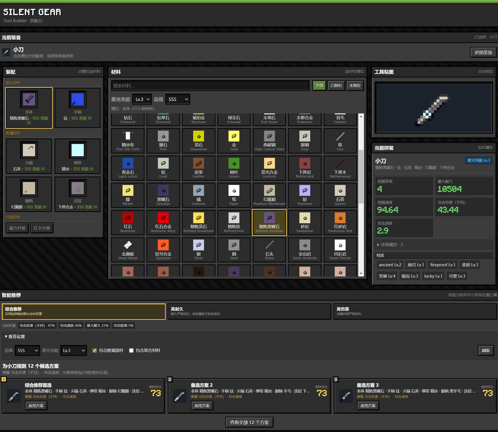

# Silent Gear 拼配台（Tool Builder）

给 Minecraft 模组 Silent Gear 的网页在线预览工具，包含工具组配最优解预览。

数据来自模组 datapack 的真实导出，计算规则按模组源码实现



## 功能

- **手动装配**：每槽可自由选材料，品级、充能
- **实时预览**：合成贴图、属性、traits、评分，改一点立刻变
- **Best Build**：多维度（充能/附属/复合材质）搜索得到用户希望最优解
- **材料库存**：点击标记是否拥有该材料，自动过滤搜索
- **评分权重**：自定义最优算法参数（`data/rating_data.json`）

## 使用

```bash
npm install
npm run dev    # 本地开发
npm run build  # 构建到 web/dist
npm test       # 260+ 条测试
```

## 结构

大致是5个方面

```
src/data/      数据仓库（材料/部件/装备类型）
src/calc/      计算引擎（三遍计算、grade/充能/synergy、trait 条件）
src/rating/    评分引擎（权重 + 群体相对归一化）
src/optimizer/ 优化器（候选生成 + 最优拼装搜索）
web/           薄 UI（零框架 TS + Vite）
```

纯 TypeScript，没有其他框架。
